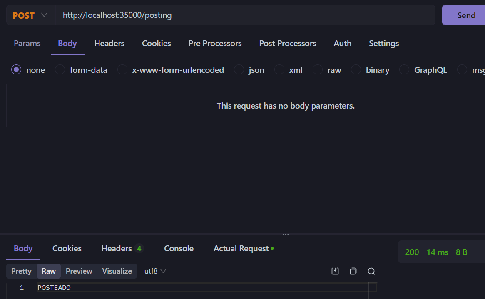

# Laboratory 3

Implementation about a clon of sparkjava with specific changes.

## Arquitecture

This project has the next components or layers:

`AppConsumer.java` Starts a sparkjava object, then it generates endpoints into sparkjava object, and finally run the server

In general is the same architecture than before, but now we have implemented a new package: spark. Here there is a class and an interface that works both for clone the funcionality of sparkjava. This class is instancied and used in Server class.

## Instalation

You must to have a SDK and maven. Then you have to download this folder, go to /server and run next commands:

```cmd
mvn package -Dskiptests
```

## Execution

1. Run the server. For this run the next command into server folder

```cmd
mvn compile exec:java
```

2. Open `http://localhost:35000/files?name=index.html`


## Running Tests

For run the unitaries tests:

1. Run the server with the previuos command
2. Run `mvn test`
3. For verify that it supports differents methods, use and app like postman and do a POST to `http://localhost:35000/posting`. It should return something like this:



4. For verify that it returns different types of file, you can try to do a GET request to:
- `http://localhost:35000/files?name=index.html`
- `http://localhost:35000/files?name=styles.css`
- `http://localhost:35000/images?name=testjp.jpg`

5. For verify that you can change file's directory, you only have to send a second parameter specifying the newPath, for example:
`http://localhost:35000/images?name=testjp.jpg&path=public/subfolder`

**There aren't anything in that folder**

## Author

Juan Pablo Fonseca


