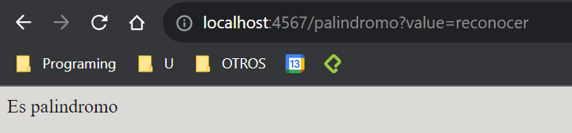

# Docker Laboratory 
Implementation of basic server using sparkjava, which is deployed using Docker and DockerHub

## Arquitecture

Architecture is so basic. There are two services, whom are invoked by SparkWebServer, exposing 4 endpoints.

## Instalation

You must to have a SDK and maven. Then you have to download this folder and run:

```cmd
mvn package
```

## Execution

1. Download this folder and run the server. For this run the next command:

```cmd
mvn compile exec:java
```

## Tests

For run test execute:
```cmd
mvn test
```

## Evidences

Because monitor doesn't trust in my links, on the next you'll see all possible URL and it image.

**http://localhost:4567/cos?value={decimal}**


**http://localhost:4567/sin?value={decimal}**


**http://localhost:4567/palindromo?value={string}**



**http://localhost:4567/magnitud?x={decimal}&y={decimal}**


**I expect that the monitor is going to replace `{decimal}` per a decimal and `{string}` per a string value like into the image's examples :)**

Here we can see an example from the client. the basic URL is `http://localhost:4567/index.html`


## Author

Juan Pablo Fonseca


