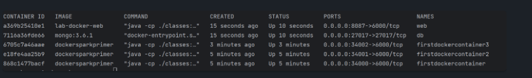

# Docker Laboratory 
Implementation of basic server using sparkjava, which is deployed using Docker and DockerHub

## Arquitecture

Architecture is so basic. There are two services, whom are invoked by SparkWebServer, exposing 4 endpoints.

## Instalation

**All commands you must execute inside *lab-docker* folder :)**

You must to have a SDK and maven. Then you have to download this folder and run:

```cmd
mvn package
```

## Execution

1. Simply run:

```cmd
docker run -d -p 4567:6000 --name dockerpablo eltiojuanchito/firstsprkwebapprepo:latest
```

and try to enter to `http://localhost:4567/index.html`. 

Unfortunately port hasn't been mapped by the code, so: if you change the port, it won't work.

On the next you can see an evidence about the process for generate docker images.


## Tests

For run unitary tests execute:
```cmd
mvn test
```

## Evidences

Because monitor doesn't trust in my links, on the next you'll see all possible URL and it image.

**http://localhost:4567/cos?value={decimal}**


**http://localhost:4567/sin?value={decimal}**


**http://localhost:4567/palindromo?value={string}**


**http://localhost:4567/magnitud?x={decimal}&y={decimal}**


**I expect that the monitor is going to replace `{decimal}` per a decimal and `{string}` per a string value like into the image's examples :)**

Here we can see an example from the client. the basic URL is `http://localhost:4567/index.html`


### Docker evidences

**Command for generate the image is `docker build --tag dockersparkprimer .`**

Multiple containers using a image:


command: `docker run -d -p 34000:6000 --name firstdockercontainer dockersparkprimer` changing 34000 for the name of port.

Docker compose: 

For this part I did docker-compose.yml and ran `docker-compose up -d`



Running image reading it from dockerHub:


with that command you will see the page in `http://localhost:4567/index.html` and use the services :)
## Author

Juan Pablo Fonseca


